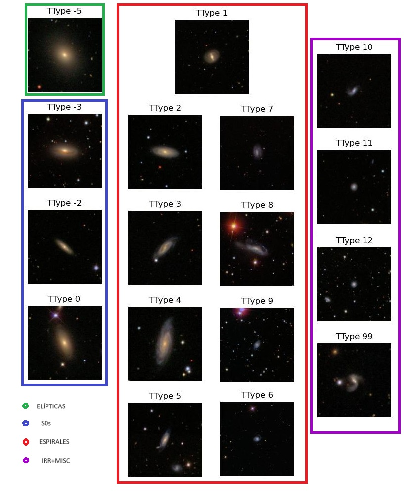
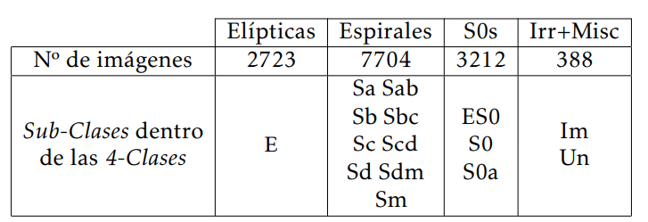
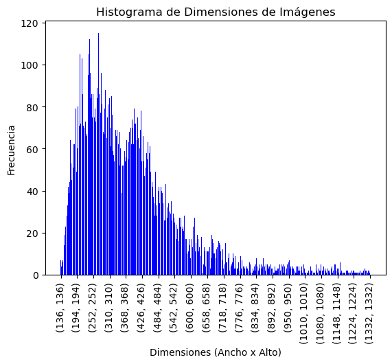
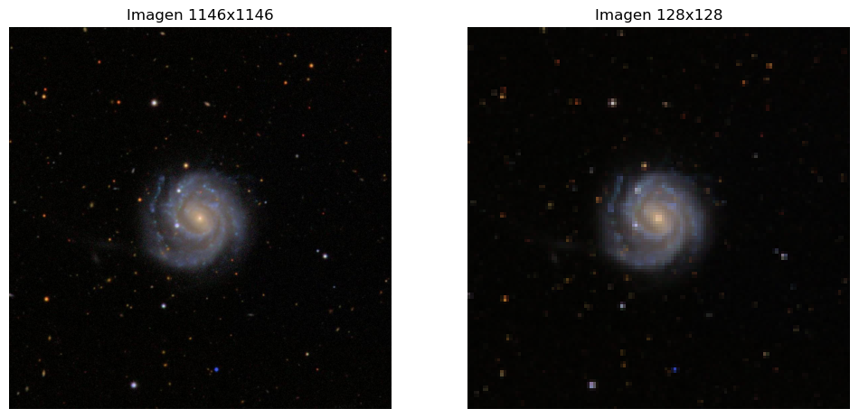
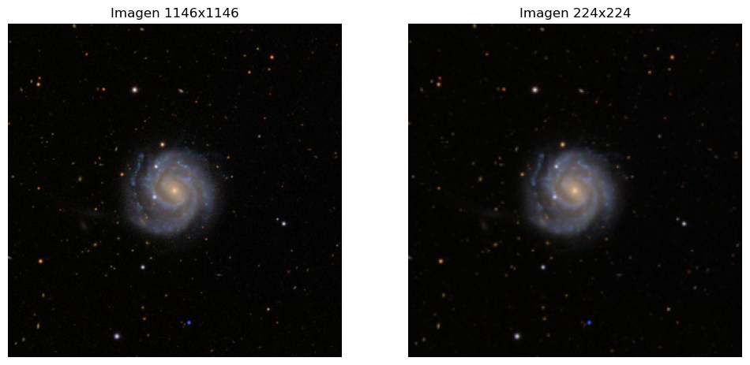
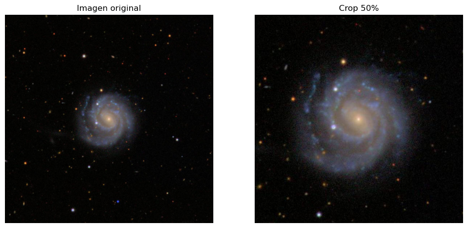
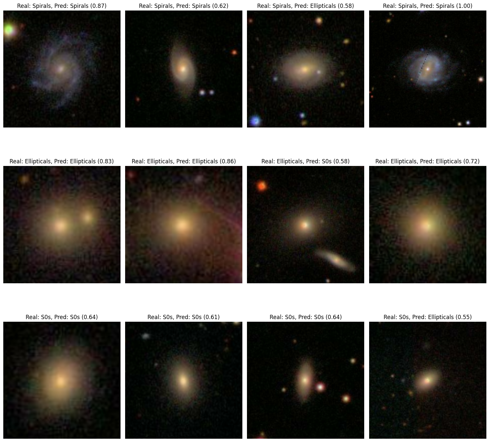
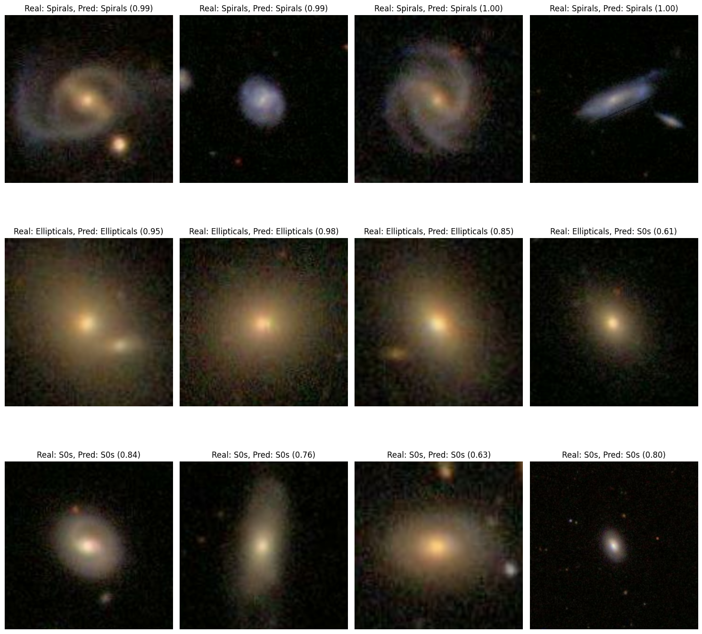
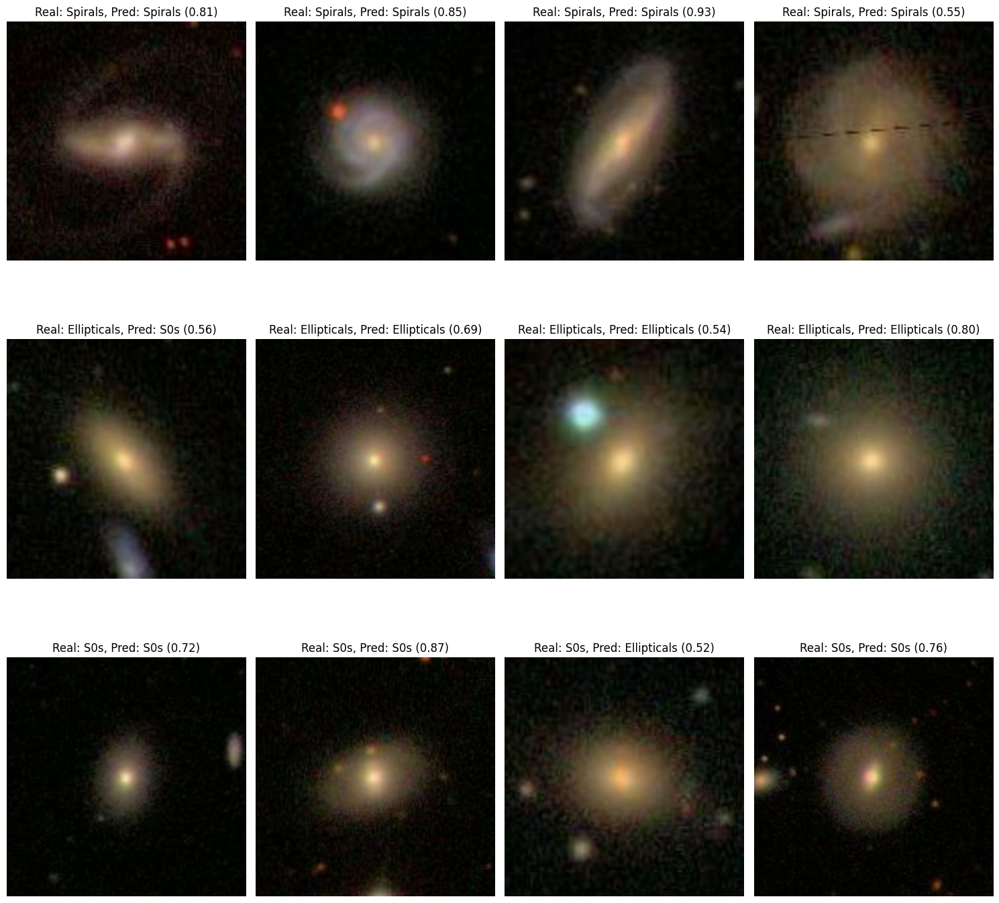

## Galactic Classification

The classification of different types of galaxies is a crucial task in astrophysics that traditionally requires extensive manual effort. With the growing volume of astronomical data captured by modern telescopes, there is a burning need for automated solutions to efficiently and accurately classify galaxies. This research aims to understand and exploit the fundamentals of deep learning, specifically convolutional neural networks (CNNs), to classify various types of galaxies. The proposed methodology includes the design of customised CNN architectures suited to the galaxy classification problem, using transfer learning and fine-tuning with three models: MobileNetV2, EfficientNet and ConvNeXt. The dataset used in this research, known as NA10, consists of a diverse collection of 14,034 galaxy images from Sloan Digital Sky Survey (SDSS). For each of the three classes, 300 images were reserved for the validation and test sets, and the rest were used for training. Significant results are obtained for each architecture, some of them close to the performances achieved in the literature.


## Authors

- [@noah-es](https://github.com/noah-es)


## Deployment

To deploy this project run the run.py code.

```bash
  python run.py
```


## Data

The dataset used is from the scientific paper published in the journal The Astrophysical Journal Supplement Series in 2010 by Preethi B. Nair and Roberto G. Abraham (NA10) [1]. It presents a catalogue of detailed visual classifications for 14 034 galaxies from the Sloan Digital Sky Survey (SDSS) Data Release 4 (DR4).
Data Release 4 (DR4). That is, it shares origin with the GZ and GZ2 projects, as both surveys were from the SDSS data.

The sample includes almost all spectroscopically observed galaxies in the redshift range.
0.01 < z < 0.1 . In addition to the classical classes of galaxies, sub-classes are recorded for more specific features such as the existence of bars, rings, lenses, tails, warps, and dust trails, among others. 

In the general catalogue, a wealth of information is provided for each galaxy. From its J2000ID, the SDSS collaboration's preferred format for object identification, to its physical quantities, such as its redshift, mass and age, luminosity, apparent magnitude, and many others. For obvious reasons, this information is not taken into account in this work, but a study on how to co-integrate images with numerical data is still pending in order to improve the analysis proposed here.

As for the visual catalogue, all images processed and catalogued using an external file are provided. In NA10 it is specified that although the images are in RGB format, the classification was carried out using only the G-band. 

They consist of images belonging to 15 different classes. This high number is due to the sensitivity of the classes. Remember that NA10 introduces more specific features, which naturally increases the number of classes. However, in this paper these TType subclasses will be grouped into 3 main classes: elliptic, spiral and lenticular (S0s).
##
* TTypes 


##
* Dataset Distribution



.png)

##
* Histogram


##
* Pre-Proccesing




##
* Data Augmentation


## Results

In this section we will present the results obtained for each architecture used.
In all the models we have used an Early-Stopping of patience 7 and monitor the validation loss. Moreover, in order to avoid class imbalance, 2100 images of each class are randomly taken in each training epoch. 


## MobileNetV2



## EfficientNet



## ConvNeXt Tiny


